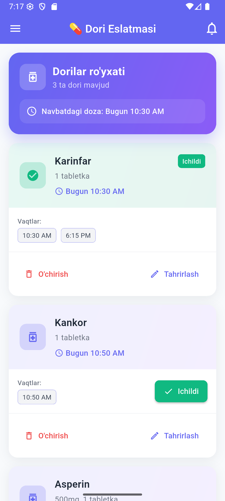
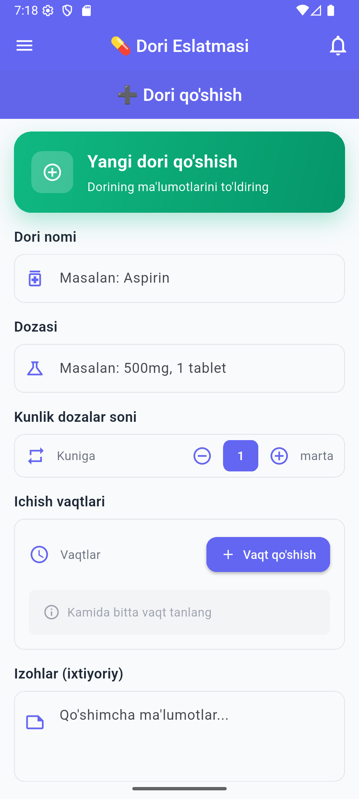
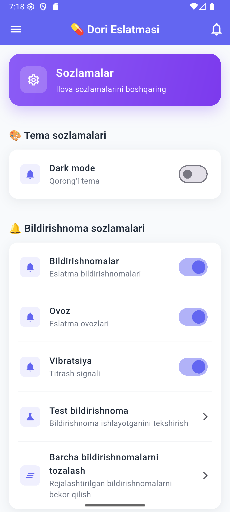
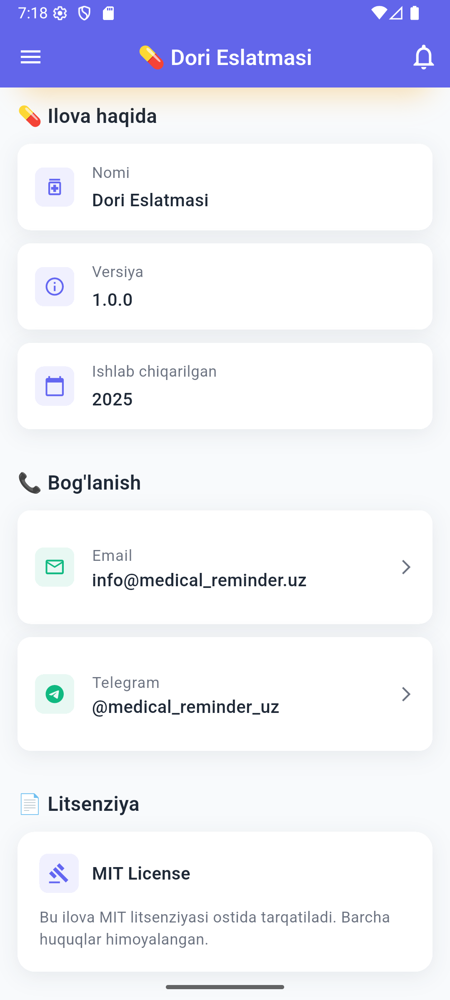

# 💊 Medication Reminder App

  
  
  
  

  
    <b>Bosh sahifa</b> &nbsp;&nbsp;&nbsp;
    <b>Dori qo'shish</b> &nbsp;&nbsp;&nbsp;
    <b>Sozlamalar</b> &nbsp;&nbsp;&nbsp;
    <b>Ilova haqida</b>
  

## 📱 Ilova haqida

**Medication Reminder** — bu dorilarni o‘z vaqtida ichishni eslatib turuvchi, zamonaviy va qulay mobil ilova. Ilova yordamida siz sog‘lig‘ingizni nazorat qilishingiz, dorilarni qabul qilishni unutmasligingiz va barcha jarayonlarni boshqarishingiz mumkin.

---

## 🖼️ Ekranlar va imkoniyatlar

### 🏠 Bosh sahifa

- **Dorilar ro‘yxati**: Barcha dorilar va ularning navbatdagi doza vaqti.
- **"Ichdim" belgilash**: Dori ichilganda tezda belgilash.
- **Kunlik progress**: Bugungi dorilar ichilgan miqdorini ko‘rish.

---

### ➕ Dori qo‘shish

- **Dori nomi va dozalash**: Yangi dori, miqdor va davomiylik kiritish.
- **Vaqtlar**: Kunlik ichish vaqtlari va eslatmalar.
- **Saqlash**: Ma’lumotlarni bazaga saqlash va bildirishnoma sozlash.

---

### ⚙️ Sozlamalar

- **Til tanlash**: O‘zbek, Rus, Ingliz tillari.
- **Tema**: Yorug‘/Qorong‘i rejim.
- **Bildirishnomalar**: Push notification va ovoz/vibratsiya sozlamalari.

---

### ℹ️ Ilova haqida

- **Versiya va ishlab chiquvchi**: Ilova versiyasi va dasturchi haqida ma’lumot.
- **Bog‘lanish**: Email va telefon orqali aloqa.
- **Litsenziya**: Open source va yangilanishlar tarixi.

---

## 🎯 Asosiy funksiyalar

- Dorilarni qo‘shish, tahrirlash va o‘chirish
- Har bir dori uchun eslatma vaqtlari
- Bildirishnomalar (push notification)
- Kunlik progress va statistikalar
- Ko‘p tilli interfeys (O‘zbek, Rus, Ingliz)
- Qorong‘i va yorug‘ rejim

---

## 🛠️ Texnik ma’lumotlar

- **Framework**: Flutter
- **Platforma**: Android, iOS, Web
- **Til**: Dart
- **Ma’lumotlar bazasi**: SQLite
- **Bildirishnomalar**: Local Notifications

---

## 📋 Bosqichma-bosqich foydalanish

1. Ilovani o‘rnating va oching
2. Drawer menyudan kerakli sahifani tanlang
3. Dori qo‘shing va eslatma vaqtlarini belgilang
4. Sozlamalardan til va tema tanlang
5. Bildirishnomalarni yoqing va sog‘lig‘ingizni nazorat qiling!

---

## 🔗 Foydali havolalar

- [Flutter Documentation](https://flutter.dev/docs)
- [Dart Language](https://dart.dev/)
- [Material Design](https://material.io/design)

---

**Ishlab chiquvchi**: Eldor  
**Versiya**: 1.0.0  
**Sana**: 2025
